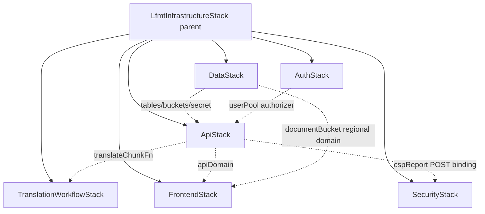

# Design: Refactor Monolithic CDK Stack into Nested Stacks

Companion to `proposal.md`. This document captures the architectural
decisions, the cross-stack reference strategy, the per-resource
migration classification, and the testing plan. A reader of this
document alone should be able to implement the refactor.

## Context

LFMT POC's `LfmtInfrastructureStack`
(`backend/infrastructure/lib/lfmt-infrastructure-stack.ts`, 2,662 LOC)
currently owns every AWS resource in the deploy. Issue #64 asks for a
plan to split it. The current state, drivers, and rejected alternatives
are documented in `proposal.md`.

Stakeholders:

- **Raymond Lei** (owner) — final approver of the implementation phases.
- **Infrastructure reviewers** — OMC security-auditor and infrastructure-auditor agents have flagged the file size in prior PR rounds (#207, #208, #216).
- **CI/CD** — deploy-backend workflow currently completes in ~7–10 min wall-clock; this proposal does not aim to reduce wall-clock by splitting (see "Deploy time analysis" below).

Constraints carried forward from `openspec/project.md`:

- POC budget: no VPC, no Route 53, no multi-region, no DDB Streams + SQS for new cross-stack messaging.
- Single AWS account, single region (us-east-1).
- Multi-environment via CDK context: dev/staging/prod.
- `retainData: false` in dev (RemovalPolicy.DESTROY), `retainData: true` in staging/prod (RemovalPolicy.RETAIN).
- ARM64 + Node 22 mandatory for all Lambdas (drift-guarded by infrastructure test).

## Goals / Non-Goals

### Goals

1. **Reduce per-PR diff scope.** A change to one Lambda's IAM policy should touch ≤2 files, not the 2,662-line monolith.
2. **Isolate stateful from stateless.** DDB + Cognito + retained S3 in their own stacks so a stateless-stack rollback cannot threaten user data.
3. **Make cross-stack dependencies explicit.** Today the constructor's call order encodes implicit ordering (CloudFront before API for CORS; API before CloudFront-CSP-update). After: CDK's `addDependency()` makes it impossible to deploy out of order.
4. **Eliminate `(this as any).<resource> = ...` escape hatches.** Each child stack owns its resources as proper public-readonly properties of its own class.
5. **Preserve all existing resource ARNs / IDs / table names / bucket names / Cognito User Pool ID / Distribution ID across the refactor.** No data loss. No user-visible URL changes. No frontend `.env` changes. No DNS changes.

### Non-Goals

1. **Reducing wall-clock deploy time.** CDK NestedStack children deploy **sequentially by default**; parallelism requires the App-level pattern with sibling stacks + explicit dependencies, which has different cross-stack-reference ergonomics. This proposal does NOT promise faster deploys; see "Deploy time analysis" below.
2. **Splitting into separate `cdk.json` apps.** The deploy pipeline still runs `cdk deploy LfmtPocDev` and gets all six children with one command.
3. **Onboarding the existing `security-stack.ts` (CloudTrail/GuardDuty/WAF).** That file already exists but is NOT composed into the app today. This proposal adopts the SecurityStack **name** for the CSP report collector + Lambda@Edge slot only. Enabling the CloudTrail/GuardDuty/WAF skeleton is tracked separately (out of scope here).
4. **Introducing custom CDK constructs.** The split uses vanilla `NestedStack` classes — no L2.5/L3 abstractions invented.

## Decisions

### Decision 1: Use `aws-cdk-lib.NestedStack` (not separate sibling stacks).

A NestedStack is a CDK construct that creates a child CloudFormation stack inside a parent. From the operator's perspective the deploy is still a single `cdk deploy LfmtPocDev`; CloudFormation handles the parent/child relationship as a `AWS::CloudFormation::Stack` resource.

**Why NestedStack and not sibling stacks**:

- **Cross-stack reference cost.** Sibling stacks share via CFN exports (the CFN stack-export limit is 200 per region, and exports cannot be deleted while a consumer is alive — they are stack-evolution traps). NestedStacks share via CDK construct references, which CloudFormation compiles into `Fn::GetAtt`/parameter references inside the child template — no exports involved.
- **Atomic deploy.** A NestedStack failure rolls the parent back, so the deploy is all-or-nothing. Sibling stacks deploy independently, which is occasionally desirable but adds operational complexity (partially-deployed states).
- **Single-source-of-truth IDs.** The frontend deploy workflow today reads `aws cloudformation describe-stacks --stack-name LfmtPocDev --query Outputs`. With NestedStacks the parent stack republishes the consolidated outputs; with sibling stacks, the workflow must read N different stacks.

**Alternatives considered**:

- **Sibling stacks (App.synth() instantiates 6 independent `Stack`s).** Rejected for the reasons above. We can revisit this in a future change if the size of any individual nested stack outgrows its sweet spot.
- **Single stack with sub-constructs (not full child stacks).** Rejected — this is essentially what we have today (the `createX()` methods are sub-construct boundaries that share `this`). Doesn't gain blast-radius isolation.

### Decision 2: Cross-stack references use CDK construct references — NOT SSM parameters, NOT CFN exports.

In CDK, when a construct in child stack A references a property of a construct in child stack B, CDK's `Stack#resolve()` machinery automatically threads the value through as either:

- a CloudFormation parameter on B (input) backed by a CloudFormation output on A (output), OR
- a `Fn::GetAtt` reference if both stacks are in the same `App` and CDK can prove the dependency.

For NestedStacks rooted in the same parent, the latter is the common case — the value is "exported" through the parent template's parameters and outputs.

**Why this, not SSM:**

- SSM-parameter sharing decouples deploy timing (child A writes a Parameter Store entry; child B reads it). The decoupling buys nothing for our use case because we deploy all six children atomically.
- SSM adds a runtime AWS API call for resource lookups — slower than CFN-native references.
- SSM-parameter contention is a real failure mode under concurrent deploys; not worth the risk for synchronously-deployed nested stacks.

**Why this, not CFN exports/imports (`Fn::ImportValue`):**

- Exports are immutable while in use. A stack-evolution mistake (e.g., renaming an output) locks the deploy. NestedStack parameter references avoid this entirely.
- The 200-exports-per-region limit is small. With ~20 cross-stack references projected here, we'd burn 10% of the regional budget on this single deploy.

### Decision 3: Each Lambda's IAM grant uses CDK `grant*` methods, NOT manual ARN strings.

The current monolith uses both patterns — some grants reference `this.jobsTable.tableArn`, others construct ARNs by hand:

```typescript
// Current (BAD - manual ARN, brittle):
resources: [`arn:aws:lambda:${this.region}:${this.account}:function:lfmt-translate-chunk-${this.stackName}`],
// Current (GOOD - CDK construct reference, brittle only across stack moves):
resources: [this.jobsTable.tableArn, `${this.jobsTable.tableArn}/index/UserJobsIndex`],
```

Cross-stack grants in CDK work because the granted construct (e.g., `jobsTable`) is _passed_ to the consuming construct's stack as a prop. The grant call then resolves to either `Fn::GetAtt` (within the same parent) or a parameter reference. The Lambda invoke ARN in `StepFunctionsExecutionRole` currently is a manual string interpolation — we replace this with `translateChunkFunction.grantInvoke(stepFunctionsRole)`.

**Implication for the implementation phase**: every `(this as any).x.tableArn` site must become `props.x.tableArn` or an equivalent `props.x.grantSomething(role)`.

### Decision 4: Frontend CSP update problem — solve via `props` propagation, not late binding.

The current monolith has a load-bearing post-hoc update:

```typescript
this.createFrontendHosting(removalPolicy); // CSP includes wildcard `*.execute-api.us-east-1.amazonaws.com`
this.createApiGateway(); // API ID now exists
this.updateCloudFrontCSP(); // Replaces wildcard with concrete domain via L1 property override
```

After the split, the same dependency must be encoded:

- `FrontendStack` is constructed with a `props.apiDomain?: string` (optional because at first construction the API may not yet be known).
- `ApiStack` exposes `api.restApiId` (or the constructed `apiDomain` string) as a public-readonly property.
- The parent stack constructs `ApiStack` BEFORE `FrontendStack` and passes `apiStack.apiDomain` into `FrontendStack`.

This **flips the current order** (today CloudFront is built before API). The flip is safe because:

- The API Gateway CORS list reads CloudFront's distribution domain only as a _fallback_ — the per-environment literal in `CLOUDFRONT_ORIGINS_BY_ENVIRONMENT` is the primary source and is already a hardcoded literal. So API Gateway can be created without CloudFront existing.
- The CloudFront distribution's CSP currently uses a wildcard `*.execute-api.us-east-1.amazonaws.com` at initial construction, then a post-hoc L1 override swaps it for the concrete API domain. After the refactor: CSP is built ONCE with the concrete API domain — no L1 override, no second `ResponseHeadersPolicy` resource. (This removes the orphan `FrontendSecurityHeadersUpdated` policy that CDK leaves behind when only the property override is updated.)

### Decision 5: Stack-deploy dependency graph

```
       App (cdk.json)
          │
          ▼
  LfmtInfrastructureStack (parent, ~150 LOC)
          │
          ├── DataStack         (DDB tables, S3 buckets, Secrets Manager)
          │         ▲
          │         │ (table ARNs, bucket ARNs, secret ARN)
          │
          ├── AuthStack         (Cognito User Pool, PreSignUp trigger)
          │         ▲
          │         │ (user pool ARN/ID, client ID)
          │
          ├── ApiStack          (API Gateway, all Lambdas, IAM roles, request validators)
          │    ▲     │
          │    │     └─ depends on: DataStack (table+bucket grants), AuthStack (Cognito authorizer)
          │    │
          │    │ (translateChunkFunction)
          │
          ├── TranslationWorkflowStack  (Step Functions state machine + execution role)
          │         ▲
          │         │ (state machine ARN)
          │
          ├── FrontendStack     (Frontend S3, CloudFront, OAC, ResponseHeadersPolicy)
          │         ▲
          │         │ (CloudFront URL, distribution ID)
          │         │
          │         └─ depends on: ApiStack (apiDomain for CSP), DataStack (documentBucket regional domain for CSP)
          │
          └── SecurityStack     (CSP report Lambda + IAM, future Lambda@Edge slot)
                    │
                    └─ depends on: ApiStack (CSP-report POST endpoint binding)
```

Mermaid form (for posterity in PR comment renders):



Note that CDK automatically infers dependencies from property references — explicit `addDependency()` calls are only required when a stack uses a value without a construct reference (e.g., reads a string from `props` that wasn't derived from another stack's construct). The graph above is the _logical_ dependency view; the _CDK-enforced_ view follows from the construct references in code.

## Per-resource migration classification

This is the load-bearing risk register. Every existing resource is classified as **rename-safe** (CDK can preserve the CFN logical ID across the move with `overrideLogicalId`) or **requires-import** (the CFN resource must be imported into the new child stack via `aws cloudformation import` so it is not destroyed).

### Stateful resources (data-loss class)

| Resource                                    | Current logical ID              | Target stack  | Classification                                      | Mitigation                                                                                                                                                                                                                                                                                                             |
| ------------------------------------------- | ------------------------------- | ------------- | --------------------------------------------------- | ---------------------------------------------------------------------------------------------------------------------------------------------------------------------------------------------------------------------------------------------------------------------------------------------------------------------- |
| `JobsTable` (DynamoDB)                      | `JobsTable<hash>`               | DataStack     | **Rename-safe via overrideLogicalId**               | Set `cfnTable.overrideLogicalId('JobsTable...')` on the DDB Table construct in DataStack to match the existing synthesized ID. Verify via `cdk diff` shows NO changes to this resource. **Pre-deploy gate**: cdk-diff in CI must show zero changes to JobsTable.                                                       |
| `UsersTable` (DynamoDB)                     | `UsersTable<hash>`              | DataStack     | **Rename-safe via overrideLogicalId**               | Same approach as JobsTable.                                                                                                                                                                                                                                                                                            |
| `AttestationsTable` (DynamoDB)              | `AttestationsTable<hash>`       | DataStack     | **Rename-safe via overrideLogicalId**               | Same approach. 7-year legal-retention TTL must NOT be lost.                                                                                                                                                                                                                                                            |
| `RateLimitBucketsTable` (DynamoDB)          | `RateLimitBucketsTable<hash>`   | DataStack     | **Rename-safe via overrideLogicalId**               | Same approach. Lower stakes (operational state, not user data) but still preserve.                                                                                                                                                                                                                                     |
| `UserPool` (Cognito)                        | `UserPool<hash>`                | AuthStack     | **Rename-safe via overrideLogicalId, BUT** see note | The Cognito User Pool is the most sensitive — recreation logs out every existing user and deletes the user record. `overrideLogicalId` is the primary mitigation. The `UserPoolDomain` is keyed off the user pool's ID + a derived account hash; preserving the User Pool's logical ID preserves the domain unchanged. |
| `UserPoolDomain` (Cognito)                  | `UserPoolDomain<hash>`          | AuthStack     | **Rename-safe via overrideLogicalId**               | Domain prefix is account-hash-based, stable.                                                                                                                                                                                                                                                                           |
| `UserPoolClient` (Cognito)                  | `UserPoolClient<hash>`          | AuthStack     | **Rename-safe via overrideLogicalId**               | Frontend reads `userPoolClientId`; if rehome preserves the client ID this is invisible to the frontend.                                                                                                                                                                                                                |
| `DocumentBucket` (S3)                       | `DocumentBucket<hash>`          | DataStack     | **Rename-safe via overrideLogicalId**               | `retainData=true` in prod (RemovalPolicy.RETAIN) is a backstop, but ALSO need overrideLogicalId so the bucket isn't orphaned + recreated.                                                                                                                                                                              |
| `ResultsBucket` (S3)                        | `ResultsBucket<hash>`           | DataStack     | **Rename-safe via overrideLogicalId**               | Same.                                                                                                                                                                                                                                                                                                                  |
| `FrontendBucket` (S3)                       | `FrontendBucket<hash>`          | FrontendStack | **Rename-safe via overrideLogicalId**               | Same approach. Frontend deploy targets this bucket by name (CDK output), so as long as bucket name is preserved, deploy pipeline is unaffected.                                                                                                                                                                        |
| `TranslationApiKeySecret` (Secrets Manager) | `TranslationApiKeySecret<hash>` | DataStack     | **Rename-safe via overrideLogicalId**               | The secret VALUE (the Gemini API key) is written out-of-band post-deploy and is preserved regardless of CFN resource recreation IF the resource is not destroyed. overrideLogicalId ensures the resource is not destroyed.                                                                                             |

**Risk explicitly stated**: if the `overrideLogicalId` approach is mis-implemented or skipped on ANY of the above, the corresponding resource is **destroyed and recreated**. For DDB tables this deletes all user data. For the Cognito User Pool, all users are deleted. There is no rollback path once CFN executes the delete. The implementation MUST be validated via `cdk diff` showing **zero changes** to each stateful resource before any deploy is run.

### Stateless resources (rebuild-safe class)

| Resource class                   | Count                 | Migration                                                                                             | Notes                                                                                                                                                                                                                                                                      |
| -------------------------------- | --------------------- | ----------------------------------------------------------------------------------------------------- | -------------------------------------------------------------------------------------------------------------------------------------------------------------------------------------------------------------------------------------------------------------------------- |
| NodejsFunction Lambdas           | 15                    | Recreate freely                                                                                       | Lambda functions are stateless except for the version/alias chain. We don't use versioned aliases, so recreate is free. Function ARN may change; consumers of the ARN are all in the same App so CDK refreshes the references.                                             |
| IAM Roles                        | 8 (7 app + 1 SF exec) | Recreate freely                                                                                       | Role ARNs change; consumers (Lambda functions, state machine) follow the construct references.                                                                                                                                                                             |
| API Gateway REST API             | 1                     | **Treat as stateless BUT preserve URL**                                                               | API ID changes when recreated → frontend `.env` REACT_APP_API_URL must update. Mitigation: overrideLogicalId on the RestApi construct too, so the API ID is preserved. This is in the rename-safe class but consequences of getting it wrong are higher than for a Lambda. |
| CloudFront Distribution          | 1                     | **Treat as stateless BUT preserve URL**                                                               | Same logic as API Gateway. CloudFront distribution ID changes are visible (e.g., d3xxx... → d4yyy...). overrideLogicalId is the right answer. Frontend domain literal in `CLOUDFRONT_ORIGINS_BY_ENVIRONMENT` is a hardcoded constant — must be re-asserted post-rehome.    |
| Step Functions State Machine     | 1                     | Recreate freely                                                                                       | ARN changes; consumer is only `startTranslation.ts` via env var → re-deploy of that Lambda picks up the new ARN.                                                                                                                                                           |
| CloudFront ResponseHeadersPolicy | 2 (will become 1)     | Recreate; the post-hoc update artifact (`FrontendSecurityHeadersUpdated`) goes away — see Decision 4. | Removing the orphan is a net win.                                                                                                                                                                                                                                          |
| OAC + bucket policy              | 1 + 1                 | Recreate freely                                                                                       | Bound to CloudFront + frontend bucket; both moved together.                                                                                                                                                                                                                |

### Migration strategy summary

The implementation phases authorized by this proposal MUST follow this order:

1. **Dev rehearsal first.** Dev environment is `retainData: false` — a worst-case big-bang recreate is tolerable (re-register test users, re-upload a sample doc). Dev is the only environment where the refactor's blast radius is bounded by "lose dev test data."
2. **Staging dry-run.** Staging is `retainData: true`. The implementation MUST land in staging with `cdk diff` showing zero deletes of stateful resources. If any stateful resource shows as "will be destroyed," the deploy is BLOCKED and the implementation must be adjusted (typically a missing `overrideLogicalId` or a typo in a logical-id string).
3. **Prod deploy only after staging stays green for one full deploy cycle.** Prod is the final stage. Rollback (see below) is theoretically available but should not be necessary if staging is well-tested.

## IAM cross-stack patterns

CDK's `grant*` methods (e.g., `table.grantReadWriteData(role)`, `bucket.grantPut(role)`, `secret.grantRead(role)`) work transparently across stacks **as long as both the granted resource and the role are reachable via construct references**. Under the hood CDK adds the appropriate IAM policy statement to the role's policy, using the granted resource's ARN reference — which becomes either a `Fn::GetAtt` (same stack) or a parameter reference (cross-NestedStack).

Implication: every IAM grant in the current monolith that uses a manual ARN string MUST be converted to a construct-reference grant during the split. Examples:

- `this.translationApiKeySecret.grantRead(translationRole)` — already correct, works cross-stack unchanged.
- `s3:DeleteObject on ${documentBucket.bucketArn}/*` constructed via PolicyStatement — works cross-stack because `bucketArn` is a CDK token.
- Manual `arn:aws:lambda:${region}:${account}:function:lfmt-translate-chunk-${stackName}` — MUST be replaced with `translateChunkFunction.grantInvoke(stepFunctionsRole)` so the reference is a CDK token, not a hand-constructed string.

The infrastructure test suite already asserts IAM scoping (no wildcards). Those assertions are stack-local — they just need to be moved to whichever stack now owns each role.

## Testing strategy

### Today

`backend/infrastructure/lib/__tests__/infrastructure.test.ts` (2,405 lines) synthesizes the whole stack:

```typescript
const stack = new LfmtInfrastructureStack(app, 'TestStack', { /* full props */ });
const template = Template.fromStack(stack);
template.hasResourceProperties('AWS::DynamoDB::Table', { ... });
```

### After refactor

One test file per child stack, each synthesizing only its own NestedStack in isolation:

```typescript
// data-stack.test.ts
const stack = new DataStack(parent, 'DataStack', { /* minimal props */ });
const template = Template.fromStack(stack);
template.hasResourceProperties('AWS::DynamoDB::Table', { ... });
// 4 tables, 5 GSIs, 3 buckets, 1 secret — small file, fast feedback.
```

Plus a `composition.test.ts` that:

1. Synthesizes the parent `LfmtInfrastructureStack`.
2. Asserts each NestedStack resource (`AWS::CloudFormation::Stack`) exists in the parent template.
3. Asserts cross-stack parameter references are wired correctly (e.g., the FrontendStack receives a parameter resolvable to ApiStack's apiDomain output).
4. Carries forward the cross-cutting drift guards: per-environment CloudFront origin map, ARM64 architecture, Node 22 runtime.

This split also lets us add per-stack tests that aren't practical today (e.g., "AuthStack template has exactly one Cognito User Pool" — a single-purpose stack makes single-purpose assertions cheap).

### Drift-guard migration

Each drift guard in the current `infrastructure.test.ts` moves to the stack that owns the resource being guarded:

| Drift guard                                                       | New home                                                                                                                                                                        |
| ----------------------------------------------------------------- | ------------------------------------------------------------------------------------------------------------------------------------------------------------------------------- |
| ARM64 architecture for every Lambda                               | api-stack.test.ts (covers 14 of 15 Lambdas); auth-stack.test.ts (covers PreSignUp inline Lambda); security-stack.test.ts (covers CSP report Lambda)                             |
| Node 22 runtime for every Lambda                                  | Same split as ARM64.                                                                                                                                                            |
| `CLOUDFRONT_ORIGINS_BY_ENVIRONMENT` covers all known environments | composition.test.ts (this constant is module-scoped and feeds both ApiStack CORS and DataStack bucket CORS — composition is the right boundary).                                |
| IAM scoping (no wildcards) per role                               | Wherever the role lives — primarily api-stack.test.ts.                                                                                                                          |
| No `(this as any)` escape hatches                                 | A new lint rule, NOT a Jest test — added as an ESLint custom rule or grep-based pre-push hook. (The refactor REMOVES the escape hatches; the test asserts they don't reappear.) |

## Deploy time analysis

The deploy-backend workflow currently completes in 7–10 minutes wall-clock. Does NestedStack splitting help?

### NestedStack default behavior

NestedStacks deploy **as part of the parent CloudFormation operation**. CloudFormation executes a CHANGE_SET against the parent template. The parent template contains six `AWS::CloudFormation::Stack` resources — CloudFormation executes them with **internal parallelism where the dependency graph allows**.

Reading the CloudFormation user guide and CDK docs:

- CloudFormation parallelizes resource creates/updates whose dependency graphs are independent.
- Children with NO dependencies on each other CAN be deployed in parallel.
- In our graph (see Decision 5), `DataStack` and `AuthStack` have no inter-dependencies — they could deploy in parallel. `ApiStack` depends on both. `FrontendStack` and `TranslationWorkflowStack` depend on `ApiStack`. `SecurityStack` depends on `ApiStack`.

### Back-of-envelope wall-clock estimate

Sequential (worst case, no parallelism): identical to today (~7–10 min).

Optimistic parallel (DataStack ∥ AuthStack, then ApiStack alone, then FrontendStack ∥ TranslationWorkflowStack ∥ SecurityStack):

- Phase 1 (DataStack ∥ AuthStack): ~2 min (slowest = AuthStack with Cognito User Pool + Domain; that's the historical bottleneck)
- Phase 2 (ApiStack alone): ~5 min (API Gateway + 15 Lambdas; this is the bulk of current deploy time)
- Phase 3 (FrontendStack ∥ TranslationWorkflowStack ∥ SecurityStack): ~3 min (slowest = CloudFront distribution propagation, which today takes 3–5 min in dev)

Total optimistic: ~10 min — slightly _worse_ than today in some scenarios, because Phase 2 (ApiStack) cannot start until both Phase 1 children complete, vs today's interleaved single-stack deploy where API Gateway and DDB tables co-deploy.

### Conclusion

**Wall-clock deploy time is NOT a goal of this proposal.** The actual benefits are:

1. **Blast-radius isolation**: a stateless-stack rollback (e.g., ApiStack) does NOT touch stateful resources.
2. **Diff scope**: `cdk diff` output for a one-Lambda change shows only ApiStack's changes, not a 2,662-LOC monolith template.
3. **Test feedback loop**: per-stack tests synth ~250 lines instead of 2,662.

The proposal must not over-claim deploy-speed benefits.

## Rollback strategy

### Within-PR rollback

If a single implementation-phase PR breaks the deploy, the rollback is `git revert` of that PR. Because each implementation phase is _one_ nested stack at a time (see tasks.md), the blast radius of any single PR's revert is limited to that one stack.

### Cross-PR rollback (catastrophic)

If a multi-PR rehome leaves the deploy in a bad state and the data-loss line is crossed (e.g., a stateful resource was destroyed), rollback is **not possible** — DDB table deletes are not reversible without point-in-time-recovery (which IS enabled on all four tables).

PITR mitigation:

- All four DDB tables have `pointInTimeRecoverySpecification: { pointInTimeRecoveryEnabled: true }` — restorable for 35 days.
- If a Cognito User Pool is destroyed, users must re-register. No automated restore.
- S3 buckets in staging/prod have `retainData: true` (RemovalPolicy.RETAIN) — destruction requires explicit override.

### Validation gate before any prod deploy

The pre-deploy CI gate MUST run `cdk diff` against staging AND prod with the new template and FAIL if any stateful resource shows as "will be replaced" or "will be removed." This is the load-bearing pre-flight check; without it, the refactor cannot safely land in stateful environments.

## Risks / Trade-offs

| Risk                                                                                                      | Severity     | Mitigation                                                                                                                                                                        |
| --------------------------------------------------------------------------------------------------------- | ------------ | --------------------------------------------------------------------------------------------------------------------------------------------------------------------------------- |
| Stateful resource accidentally destroyed (DDB table or Cognito User Pool)                                 | **Critical** | `overrideLogicalId` on every stateful construct + `cdk diff` zero-changes gate in CI; staging dry-run before prod.                                                                |
| API Gateway URL changes, frontend `.env` breaks                                                           | High         | `overrideLogicalId` on the RestApi construct + ApiId/ApiUrl drift-guard test.                                                                                                     |
| CloudFront distribution domain changes, hard-coded `CLOUDFRONT_ORIGINS_BY_ENVIRONMENT` literal goes stale | High         | `overrideLogicalId` on the Distribution construct + post-deploy assertion that the literal still matches the live domain. Add a synthetic E2E check that hits the literal domain. |
| CFN parameter limit hit (cross-stack references)                                                          | Low          | NestedStack parameter limit is 200 per child template (default; raisable). Projected usage ≤30 references. Comfortably within limits.                                             |
| CDK upgrade breaks NestedStack synthesis                                                                  | Low          | aws-cdk-lib NestedStack API is stable; semver-major bumps are rare. Existing pre-push hooks validate every CDK change with `cdk synth`.                                           |
| Deploy time increases                                                                                     | Medium       | Acknowledged in "Deploy time analysis" above; the proposal does not promise speedup. If wall-clock becomes a problem, revisit sibling-stack architecture (future change).         |
| `tasks.md` granularity drives implementation off the per-PR-size limit                                    | Low          | Tasks are sequenced per-stack; each stack is its own PR. The largest (`ApiStack`) is the biggest risk — split into sub-PRs if review fatigue surfaces.                            |

## Migration plan (high-level)

The detailed task breakdown lives in `tasks.md`. The high-level phasing:

1. **Phase 0 (this PR)**: scaffold proposal + design + tasks + spec deltas; validate with `openspec validate --strict`. **No code changes.**
2. **Phase 1**: extract `DataStack` (stateful, lowest churn). Validate via `cdk diff` showing zero changes. Merge.
3. **Phase 2**: extract `AuthStack`. Same validation.
4. **Phase 3**: extract `TranslationWorkflowStack` (it's the most self-contained stateless piece).
5. **Phase 4**: extract `FrontendStack`. Reconcile the CSP-update flip (Decision 4).
6. **Phase 5**: extract `SecurityStack` (CSP report Lambda + future Lambda@Edge slot).
7. **Phase 6**: extract `ApiStack` (the biggest piece, ~1,200 lines). This is last because by the time we get here, every cross-stack reference pattern is already proven by earlier phases.
8. **Phase 7**: cleanup — remove orphaned helpers from the parent stack, finalize per-stack test files, update `infrastructure.test.ts` to `composition.test.ts`.

Rollback after each phase is `git revert` of that phase's PR.

## Open Questions

1. **Should `LegalAttestations` (currently in DDB) move to its own stack as we wire up the production write path?** Cross-cutting with the `legal-attestation-production` capability work. Not in this proposal's scope, but the `DataStack` boundary is wide enough to absorb it.
2. **Does staging/prod use `retainData: true` for the FrontendBucket?** Today yes; this is preserved. But the frontend bucket is genuinely stateless — its contents are regenerated by every deploy from the `frontend/dist/` build artifact. Worth a follow-up discussion on whether prod should switch to `retainData: false` to simplify the rehome.
3. **Is there a per-stack `cdk.json` budget concern?** Each NestedStack adds a separate synthesized template. With six children + the parent, that's 7 CloudFormation templates per deploy. CFN allows 200 templates per stack hierarchy — comfortably within limits, but worth noting.
4. **Lambda@Edge for SecurityStack — when does #254 work land?** If #254 is imminent, the SecurityStack split timing should align so we don't double-touch the file. Owner decision.
